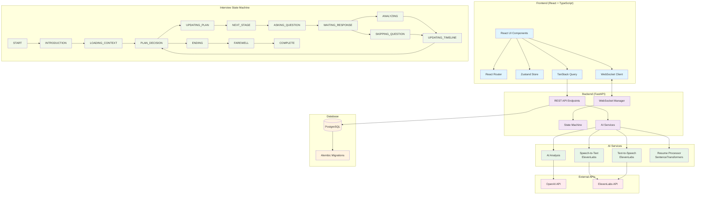

<p align="center"></p>
  
</p>

---

AI-ассистент для проведения автоматизированных собеседований с кандидатами. Система использует машинное обучение, LLM и обработку естественного языка для анализа резюме, проведения интервью в реальном времени и оценки кандидатов.

## Ссылки

- [Figma проекта с идеями по проекту и брейнштормами](https://www.figma.com/board/fHNEx0dIU2fLStCXCqQXZ0/more-tech--hackathon-?node-id=22-1190&t=VXVf54vZclqED8XE-1)
- [Развернутый Backend на VPS сервере](http://77.110.114.85:5173)
- [Развернутый Frontend на Vercel](https://more-tech-vtb-frontend.vercel.app)

## Описание проекта

[HR Avatar](http://77.110.114.85:5173) — интеллектуальная платформа, предназначенная для автоматизации найма с помощью искусственного интеллекта. Система взаимодействует с кандидатами, оптимизируя процесс подбора персонала и повышая продуктивность HR-отдела.

### Основные возможности:

1. **Анализ резюме**
   - Автоматическое извлечение навыков и опыта из резюме
   - Сравнение с требованиями вакансии
   - Векторный анализ соответствия (SentenceTransformers)
   - LLM-анализ для глубокой оценки

2. **Проведение интервью в реальном времени**
   - AI-интервьюер с голосовым интерфейсом
   - Автоматическая генерация вопросов на основе контекста
   - Обработка речи в реальном времени (Speech-to-Text)
   - Синтез речи для ответов AI (Text-to-Speech)
   - Анализ ответов кандидата с оценкой

3. **Управление состоянием интервью**
   - State Machine для контроля процесса интервью
   - WebSocket для real-time коммуникации
   - Автоматические переходы между этапами
   - Сохранение истории и результатов

4. **Система оценки**
   - Многокритериальная оценка ответов
   - Анализ технических навыков, коммуникации, релевантности
   - Генерация детальной обратной связи
   - Рекомендации по найму

### Архитектура системы:


## Технологический стек

### Backend

- **FastAPI** - современный веб-фреймворк для API
- **SQLAlchemy** - ORM для работы с базой данных
- **Alembic** - миграции базы данных
- **PostgreSQL** - основная база данных
- **WebSocket** - real-time коммуникация
- **OpenAI API** - LLM для анализа и генерации текста
- **ElevenLabs** - синтез и распознавание речи
- **SentenceTransformers** - векторный анализ текста

### Frontend
- **React 19** - UI библиотека
- **TypeScript** - типизированный JavaScript
- **Vite** - быстрый сборщик
- **React Router** - маршрутизация
- **Tailwind CSS** - стилизация
- **Shadcn UI** и **Radix UI** - компоненты интерфейса
- **Axios** - HTTP клиент

### DevOps
- **Docker** - контейнеризация
- **uv** - менеджер зависимостей Python
- **Yarn** - менеджер пакетов Node.js

## Конфигурация и деплой

- [backend](https://github.com/fresh-milkshake/more_tech_vtb_hackathon/blob/main/backend/README.md)
- [frontend](https://github.com/fresh-milkshake/more_tech_vtb_hackathon/blob/main/frontend/README.md)

## Структура проекта

```
more-tech/
├── backend/                # FastAPI backend
│   ├── app/
│   │   ├── api/            # API endpoints
│   │   ├── core/           # State machine и бизнес-логика
│   │   ├── models/         # SQLAlchemy модели
│   │   ├── schemas/  
│   │   ├── services/ 
│   │   └── main.py    
│   ├── alembic/            # Миграции БД
│   ├── tests/
│   └── pyproject.toml 
├── frontend/               # React frontend
│   ├── src/
│   │   ├── components/     
│   │   ├── pages/          # Страницы приложения
│   │   ├── services/       
│   │   ├── store/          
│   │   └── router/         # Маршрутизация
│   └── package.json        
├── interview_pipeline.py   # Скрипт для тестирования воркфлоу интервью
├── resume_review.py        # Скрипт для анализа резюме
└── README.md
```

## Основные компоненты

### Машина состояний

Система управления состоянием интервью с автоматическими переходами:
- `START` → `INTRODUCTION` → `QUESTION_GENERATION` → `WAITING_RESPONSE` → `RESPONSE_ANALYSIS` → `PLANNING` → `FAREWELL` → `COMPLETED`

### Real-time

Обработка аудио в реальном времени:
1. Получение аудио-чанка
2. Speech-to-Text (ElevenLabs)
3. Анализ ответа (OpenAI GPT)
4. Генерация следующего вопроса
5. Text-to-Speech (ElevenLabs)
6. Отправка аудио-ответа

## Авторы

- [Taneellaa / Artemy](https://github.com/Taneellaa) - frontend и UX/UI дизайн
- [fresh-milkshake / Nikita](https://github.com/fresh-milkshake) - backend и база данных
- [bolgoff / Andrew](https://github.com/bolgoff) - ML и работа с LLM
- [IrkaKeller / Irina](https://github.com/IrkaKeller) - менеджер и тестировщик